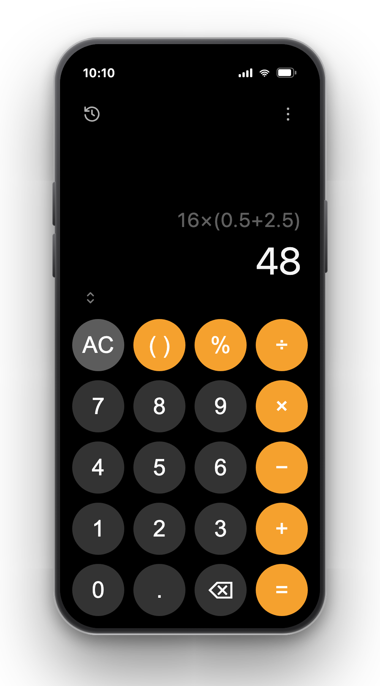

# Android Calculator for iPhone

A faithful clone of the **Android (Google) Calculator**, built as an installable **PWA** so you
can add it to your iPhone home screen and use it like a native app — history, live results, and
intelligent parentheses included. No App Store, no Xcode, no build step.

<p align="center">
  
</p>

<p align="center">
  <strong>▶ Live app:</strong>
  <a href="https://jithinolickal.github.io/android-calculator-for-iphone/">jithinolickal.github.io/android-calculator-for-iphone</a>
</p>

<p align="center">
  <a href="https://jithinolickal.github.io/android-calculator-for-iphone/"></a>
  <a href="https://github.com/jithinolickal/android-calculator-for-iphone/actions/workflows/test.yml"></a>
  <a href="LICENSE"></a>
  
  
  
</p>

## Why

The stock iPhone calculator lacks a history tape, live results, and easy expression editing — the
Android calculator does all of this well. This recreates its look and core behaviour as a tiny web
app you can install on any phone, straight from the browser.

## Features

- **Live results** — the answer updates as you type, before you press `=`
- **Intelligent parentheses** — one `( )` key decides `(` vs `)` by context and auto-inserts `×`
  (so `16` then `(` becomes `16×(` )
- **History** — a panel that slides over the keypad; tap a past entry to reuse its result;
  persisted on-device
- **iOS-style result view** — after `=`, the expression shrinks and greys while the result grows
- **Two themes** — Violet and Orange, switchable from the menu and remembered
- **Installable & offline** — add to home screen; works with no network (service worker)
- **Keyboard support** on desktop

## Use it on your iPhone

1. Open the app in **Safari**: **https://jithinolickal.github.io/android-calculator-for-iphone/**
2. Tap the **Share** button → **Add to Home Screen**.
3. Launch it from the home screen — it runs full-screen, offline, like a native app.

## Run locally

It's plain static files — serve the folder with anything:

```bash
python3 -m http.server 8000
# then open http://localhost:8000
```

(A static server is needed for the service worker; opening `index.html` via `file://` won't
register it.)

## Tests

The calculator logic in `calc.js` is pure and unit-tested with Node's built-in test runner — no
dependencies to install:

```bash
npm test          # or: node --test
```

Run these before any change; they guard the math engine and input rules against regressions.

## How it works

- **Vanilla HTML/CSS/JS**, no framework or build step — just files a static host serves directly.
- **`calc.js`** holds all pure calculator logic: a hand-written recursive-descent parser (no
  `eval()`, no math libraries), the input rules, and number formatting. It's framework-free and
  fully unit-tested.
- **`app.js`** is the thin UI layer: it keeps the state, renders, and wires up events.
- **Themes** are pure CSS custom properties toggled via a `data-theme` attribute.
- **PWA**: `manifest.json` + a service worker (`sw.js`) cache the app shell for offline use.

```
├── index.html        # markup
├── styles.css        # themes, layout, animations
├── calc.js           # pure calculator logic (unit-tested)
├── app.js            # UI layer: state, render, events
├── manifest.json     # PWA metadata
├── sw.js             # service worker (offline cache)
├── icons/            # app icons
├── tests/            # node --test specs
└── docs/plan.md      # design & roadmap
```

## Roadmap

- **v1** — basic calculator, intelligent parens, history, live results, themes ✅
- **v2** — contextual percentage (`100 + 10%` = `110`, the way Android does it)
- **v3** — scientific panel, light theme, smoother transitions

See [`docs/plan.md`](docs/plan.md) for details.

## Contributing

Contributions are welcome!

1. Fork the repo and create a branch (`git checkout -b feat/your-feature`).
2. Make your change. If it touches calculator behaviour, **add/adjust tests in `tests/`**.
3. Run `npm test` and make sure everything passes.
4. Open a pull request describing what changed and why.

Keep it simple and dependency-free — the project's goal is a tiny, fast, no-build PWA. Please don't
add frameworks or a build step.

## License

[MIT](LICENSE) © Jithin Joseph
